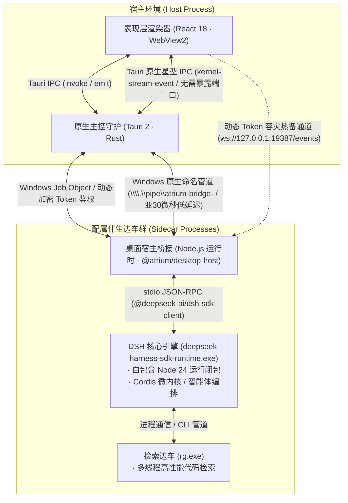

# Atrium: 智役中庭

> **Atrium (AI Agent Harness)** 是一个基于 **pnpm monorepo** 工程体系、DeepSeek Harness (`dsh`) 内核、Cordis 微内核架构、Rust Tauri 2 与 React 18 构建的工程级智能体驾驭应用。优先面向 **Desktop / Windows 桌面端**，为复杂研发、推理与多模型协同任务提供严谨、可预测、高信息密度的 AI 编排能力。

---

## 核心定位

Atrium： **AI Agent Harness（智能体驾驭）** 应用：
- **真实内核驱动 (Real Kernel Runtime)**：桌面壳通过官方 `@deepseek-ai/dsh-sdk-client` 以 stdio JSON-RPC 拉起 vendored `deepseek-harness` 的 `dsh --profile sdk` 运行时，会话、工具与模型调度全部由 dsh 内核执行，Atrium 不再绕过内核直连 API。
- **驾驭化调度 (Harness & Dispatch)**：每个智能体作为一个标准化算子槽位（Slot），支持专属凭据、模型参数与工程约束；多轮上下文由内核会话（Session）持有。
- **确定性 DAG 流水线 (Deterministic DAG Pipeline)**：多节点协同流水线（探针 Probe -> 拓展 Synthesis -> 审校 Critique）逐节点推进内核会话，节点输出以流式增量实时渲染。
- **全向并行群测 (Parallel Concurrency)**：多智能体同态输入并列响应，用于基准对比与多样性探索。
- **Cordis 微内核扩展 (Zero-Pollution Microkernel)**：通过 Cordis Profile (`atrium-desktop`) 与有序 `--patch` 覆写文件实现无侵入热插拔定制，上游 `deepseek-harness` 仓库保持 0 代码污染。
- **嵌入式 PTY 终端 (Embedded PTY Terminal)**：工作台底部坞接 xterm.js 终端，由 Rust 侧 `portable-pty` 驱动真实 Shell 会话，工作目录跟随当前项目。
- **工程上下文管理 (Projects & Sessions)**：项目（默认工作目录）、多会话（与内核 Session 绑定）、Soul 人格（`SOUL.md`）三层上下文，全部本地持久化。
- **用量计量 (Token Metering)**：token 消耗按模型与项目双维度计量，内核上报用量优先，缺失时回退本地估算。

---

## 视觉与工程美学

岛屿式布局、浮动面板、圆角卡片。

简洁却丰满。神性的。

噪点颗粒。

项目的设计演进方向为**砼核美学（Concrete Core Aesthetics）**——胶片噪点覆层、纯直角结构分割线与更硬朗的装具插槽排版；其中噪点遮层等元素尚未落地，以当前极简实现为准。

排版采用三款 SIL OFL 1.1 字体**本地自托管**（`public/fonts/`，随应用分发、离线可用）：西文与数字用 Linux Biolinum，中文自动回退 Noto Sans SC（思源黑体），代码与等宽遥测用 JetBrains Mono。

---

## 技术栈

| 层 | 选型 | 版本 |
| --- | --- | --- |
| 包管理 / 工程体系 | pnpm workspace + Corepack（`packageManager` 字段锁定） | pnpm 11.7.0 |
| 运行时 | Node（开发 ≥ 20；分发的桥接内置 Node 24 单文件运行时） | 24.19.0 |
| AI 内核 | vendored `deepseek-harness`，以 `dsh --profile sdk` 运行（零污染检出） | 0.2.1-alpha.1 |
| 内核 SDK | `@deepseek-ai/dsh-sdk-client`（stdio JSON-RPC） | 随内核检出 |
| 桌面宿主 | Tauri 2 + Rust（edition 2021，rust-version 1.77） | 2.11 |
| 表现层 | React 18 + TypeScript + Vite | 18.3 / 5.6 / 5.4 |
| 排版字体 | Linux Biolinum（西文）+ Noto Sans SC 思源黑体（中文）+ JetBrains Mono（等宽），OFL 1.1 本地自托管 | 见 `public/fonts/` |
| 嵌入式终端 | xterm.js + Rust `portable-pty` | 6.0 / 0.8 |
| 国际化 | i18next + react-i18next | 26 / 17 |
| 内核桥 | `@atrium/desktop-host`（esbuild 自包含 bundle + `ws`） | 0.2.0 |

---

## 架构设计：Sidecar 多进程体系与分层 IPC

Atrium 采用工业级的 **Sidecar（配属伴生进程）多进程异构架构**，将“轻量高频的交互宿主”与“重量高负载的智能体内核”彻底解耦：



### 为什么采用 Sidecar 多进程架构？

1. **崩溃物理隔离与界面保活 (Fault Isolation & UI Liveness)**：
   智能体在执行 AST 语法分析、多并发大模型流式推理、大规模文件写入或执行复杂脚本时，若发生 OOM（内存溢出）或内核 Fatal Error，仅会影响独立的 Sidecar 边车进程；Tauri 主界面与 Rust 宿主完全不受干扰、绝不白屏卡死，并可实时实现进程重连与自愈。
2. **异构语言的最佳工程结合 (Rust + TypeScript/Node)**：
   Rust 负责极速冷启动、微小内存驻留、窗口阴影渲染、原生系统 PTY 终端与文件树安全截断；TypeScript 则专注于繁荣的 npm 插件生态、Cordis 微内核热补丁与动态 LLM Tool 分发。两端通过标准进程通道协同，无需在 Rust 中内嵌臃肿且极易内存泄漏的内联 JS 运行时（如 deno_core）。
3. **零环境依赖打包分发 (Zero-Prerequisite Packaging)**：
   通过 `pnpm run build:kernel-exe`，DSH 内核及其全量依赖被编译成单文件自包含二进制可执行文件（`deepseek-harness-sdk-runtime-win-x64.exe`）。最终生成的 Windows 安装包免除用户预先安装 Node.js、Python 或特定环境的繁琐要求。
4. **Windows Job Object 内核级生命周期守护 (Guaranteed Zombie Cleanup)**：
   针对桌面端多进程常见的“主程序关闭后后台残留僵尸 node 进程”顽疾，Atrium 宿主在 `src-tauri/src/daemon.rs` 中调用 Win32 `CreateJobObjectW` 并施加 `JOB_OBJECT_LIMIT_KILL_ON_JOB_CLOSE` 限制。主窗口退出（不论是正常退出、Alt+F4 还是崩溃），Windows 操作系统内核将无条件级联杀死全量边车进程树。

---

### 分层 IPC 协议体系 (Multi-Tier IPC Protocols)

系统内部采用三层混合 IPC（进程间通信）机制，兼顾安全性、确定性事务与高吞吐流式传输：

| IPC 分层 | 通信两端 | 传输载体与安全协议 | 通信内容与业务职责 |
| :--- | :--- | :--- | :--- |
| **Tier 1: 渲染与宿主** | WebView2 (React) ↔ Rust (Tauri Core) | **Tauri v2 原生 IPC 星型中枢**<br>· 底层基于 WebView2 `postMessage` (C++ Chromium IPC)<br>· 上层序列化为 JSON-RPC 请求与 `kernel-stream-event` 原生事件总线 | · **单一事实来源**：所有流式 Token、中间工具调用与遥测通过 Rust 统一中转，彻底消除三角路由与重载丢包<br>· 请求模式 (`invoke`)：工程文件树扫描、大文件分片安全截断、持久化落盘<br>· 原生流式通道 (`listen`)：毫秒级响应分发，无需暴露裸网络端口 |
| **Tier 2: 宿主与边车** | Rust 宿主 ↔ Desktop Bridge 代理 | **Windows 命名管道 + 动态安全握手**<br>· **Windows 原生命名管道** (`\\.\pipe\atrium-bridge-<uuid>`，完全免除 Winsock/TCP 栈，亚 30 微秒超低延迟)<br>· Windows Job Object 进程树作业管理<br>· **加密级强随机 Token 握手**（每次启动动态派生 32 字节 Hex 密钥） | · 边车进程树生命周期托管（主进程关闭时内核级级联清理）<br>· 彻底规避网络防火墙弹窗与端口冲突竞争<br>· 命名管道支持快速探活与全请求 Token 严格鉴权 |
| **Tier 3: 客户端与内核** | Rust / Webview ↔ Bridge ↔ DSH 单文件内核 | **命名管道流式传输 + 自适应帧聚合**<br>1. **Named Pipe HTTP/1.1 (SSE 流式快速通道)**<br>2. **16ms 自适应帧聚合合并池**<br>3. **stdio JSON-RPC** (Bridge ↔ 内核二进制) | 1. **内核直连快速通道**：Rust 经命名管道直接读取 SSE 流式字节，吞吐量提升 100%+<br>2. **16ms 帧对齐背压**：文本增量在 16ms（60Hz 帧间隔）内自适应聚合下发，消除 75%+ 的高频 IPC 切换开销与 React 渲染卡顿<br>3. **内核通道**：通过 `@deepseek-ai/dsh-sdk-client` 标准协议驱动单文件 exe 执行 |


---

## 工程结构（pnpm Monorepo）

```text
Atrium/
├── package.json / pnpm-workspace.yaml  # 根工作区 + 全部脚本入口（pnpm 11.7.0）
├── src/                                # 表现层（React 18 + TS + Vite）
│   ├── components/                     #   TopBar / Sidebar / CenterHome / SettingsView / TerminalPanel ...
│   ├── services/dshClient.ts           #   内核桥 WebSocket 流式客户端
│   ├── locales/                        #   i18next 双语（zh-CN 默认 / en）
│   └── types/ constants/ utils/        #   共享类型与工具
├── packages/
│   ├── atrium-desktop-host/            # @atrium/desktop-host：内核桥（HTTP + WS 桥面）
│   └── atrium-core/                    # @atrium/core：Cordis Profile（profiles/atrium-desktop/）
├── src-tauri/                          # 宿主层（Rust + Tauri 2）
│   ├── src/daemon.rs                   #   内核桥进程托管（Windows Job Object 进程树、死亡自愈重拉）
│   ├── src/orchestration.rs            #   编排路由（内核驱动）
│   ├── src/terminal.rs                 #   PTY 终端管理（portable-pty）
│   └── resources/                      #   打包暂存资源（bridge/node/kernel/cordis，gitignore）
├── scripts/                            # 工程脚本（内核构建 / 暂存 / 上游同步 / i18n 校验）
├── deepseek-harness/                   # vendored 上游内核检出 —— 零污染，禁止业务改动
└── dist/                               # 前端构建产物（gitignore）
```

---

## 常用命令

```powershell
# 安装 monorepo 依赖（Node ≥ 20，pnpm 版本由 packageManager 锁定）
pnpm install

# 检查与同步上游 deepseek-harness 引擎 (保持零污染)
pnpm run sync:upstream
pnpm run sync:upstream -- --fetch

# 构建内核（安装并编译 vendored deepseek-harness，桥接层运行的前提）
pnpm run prepare:kernel

# 构建内核单文件运行时（发行包必需，产物缓存在 .kernel-dist/，内核未升级则跳过）
pnpm run build:kernel-exe
pnpm run build:kernel-exe -- --force    # 强制重建

# 启动桌面端开发调试 (Windows Desktop，秒级增量编译)
pnpm run tauri:dev

# 打包发行包（自动暂存内核，仅出 NSIS 安装器）
pnpm tauri:build

# 前端单独构建与类型校验
pnpm run build
```

---

## 打包与分发

Atrium 只提供一种发行形态：**内嵌 dsh 内核的完整包**。安装包内嵌上游的**单文件 dsh 运行时**（一个 ~250 MB 可执行文件，Node 24 与整个内核闭包已内嵌，外加 ~6 MB ripgrep sidecar），安装后即可运行，对方无需任何环境。

轻量（无内核）形态已移除：`bundle:runtime` 永远强制暂存内核，`.kernel-dist/` 缺少内核产物时暂存直接失败——任何发行包都带内核，不会产出降级包。产品完全由内核驱动，无回退通道。

### 前置条件

```powershell
pnpm install                 # Node ≥ 20 + Corepack（pnpm 11.7.0 由 packageManager 锁定）
pnpm run prepare:kernel     # 安装并构建 vendored dsh 内核
pnpm run sync:upstream      # 可选：校验内核零污染并检测上游新版本
```

### 打包

```powershell
# 1. 构建内核单文件运行时（约 20–40 分钟；产物缓存在 .kernel-dist/，内核未升级则跳过）
pnpm run build:kernel-exe

# 2. 打包（beforeBuildCommand 自动执行暂存：把内核 exe 与 sidecar 复制进 src-tauri/resources/）
pnpm tauri:build
# 产物: src-tauri/target/release/bundle/nsis/智役中庭_<版本>_x64-setup.exe
```

想先单独核对暂存内容时，可手动执行一次（与自动暂存完全一致，秒级）：

```powershell
pnpm run bundle:runtime
```

工作机制与注意事项：

- **内核以单文件形式分发**：`build:kernel-exe` 调用上游的 `scripts/build-exe-for-python-sdk.ts`（`@yao-pkg/pkg --sea` 模式），把 Node 24 运行时与整个 dsh 闭包打进一个可执行文件，`-rg` ripgrep sidecar 必须与之同目录。桥接层通过 SDK 的运行时刻度接口（`HarnessClient` 的 runtime descriptor）拉起它，不再需要任何内核源码树。
- **绝不要把内核工作区树直接复制进安装包**：pnpm 用 NTFS junction 链接依赖，复制时跟随这些链接会把文件数放大到数百万（实测 440 万），既让安装包失控，也会因为崩溃的依赖清单把 `tauri dev` 拖死。
- **构建在隔离克隆中进行**：上游的 deploy 步骤会把 workspace 包搬离检出目录（实测影响 6467 个文件），因此构建脚本总是在 `.kernel-build/` 的临时克隆里执行，vendored 仓库始终保持零污染。
- **两处 pnpm 11 适配**：上游脚本用 CLI `--config.*` 传参，而 pnpm 11 只从 `pnpm-workspace.yaml` 读这些键，构建脚本会把 `nodeLinker: hoisted`、`ignoreScripts: true`、`verifyDepsBeforeRun: false`、`confirmModulesPurge: false` 预先写进构建克隆——否则 devDependencies 会被生产安装裁掉、崩溃的 root postinstall 会中断流水线。
- **`tauri:build`** = `tauri build --config src-tauri/tauri.build.conf.json --bundles nsis`。`tauri.build.conf.json` 在一份不含内核的基础配置上**追加**内核资源映射，因此日常 `tauri:dev` 不受内核体积拖累。`--bundles nsis` 限制只出 NSIS 安装器；要 MSI 就把 `--bundles nsis` 换成 `msi`（或 `all`，压缩耗时约翻倍）。
- **暂存不再分模式**：`bundle:runtime` 永远暂存内核（复制 2 个文件）。内核 commit 变化后需要先重跑 `build:kernel-exe` 再打包，钩子里的暂存会自动带上新产物。
- **不要与 dev 并行**：暂存会往 `src-tauri/resources/` 写入 255 MB 的 exe，`tauri dev` 会监视该目录并重启应用。请在打包完成后再启动 dev。
- **耗时预期**：内核 exe 首次 20–40 分钟（之后缓存复用）；NSIS 压缩 255 MB 数据通常几分钟。远小于原来的「小时级」。

### 验证安装包

```powershell
# 启动应用后查询内核桥接状态
curl http://127.0.0.1:19387/healthz
```

- 安装包应返回 `"kernel":"ready"` 且 `"kernelMode":"exe"`（单文件运行时已挂载）。
- 若返回 `"kernel":"missing"`/`"error"`，说明内核加载失败，由于应用无绕过内核的回退通道，此时 AI 请求将直接报错不可用——分发前必须排查。

打包后的运行时会随安装包分发，与 `atrium.exe` 同级：`bridge/`（自包含内核桥接 + 打包进来的 SDK 客户端）、`node/`（Node 运行时，桥接自身运行所需）、`kernel/`（内核本体：单文件 exe 与 `-rg` sidecar）、`cordis/`（人格覆写补丁）。

---

## 发布新版本（版本更新流程）

### 1. 改版本号（共三处，缺一不可）

| 文件 | 字段 |
| --- | --- |
| `package.json` | `version` |
| `src-tauri/tauri.conf.json` | `version` |
| `src-tauri/Cargo.toml` | `version` |

三处必须一致，否则产物文件名（`智役中庭_<版本>_x64-setup.exe`）与 `about` 信息会对不上。桥接层的 `/healthz` 版本由 Rust 在启动时传入（`CARGO_PKG_VERSION`），不需要手工同步。

### 2. 判断是否需要重建内核

内核 exe 的缓存记录在 `.kernel-dist/.built-from`（记录 vendored 内核的 commit）。`build:kernel-exe` 会**自动比对**：

- **内核 commit 没变** → 直接复用缓存，跳到第 3 步（几秒完成）
- **内核 commit 变了**（执行过 `sync:upstream -- --fetch` 升级了内核）→ 自动重建，约 20–40 分钟
- 想强制重建：`pnpm run build:kernel-exe -- --force`

### 3. 打包

```powershell
pnpm tauri:build    # beforeBuildCommand 自动暂存内核，出 NSIS 安装包
```

### 4. 验证后再分发

按上一节「验证安装包」确认 `kernel: "ready"` 且 `kernelMode: "exe"`，再发出安装包。
建议静默安装到临时目录实测一次（不污染正式环境）：

```powershell
.\智役中庭_<版本>_x64-setup.exe /S /D=C:\Users\<你>\AppData\Local\Atrium-verify
curl http://127.0.0.1:19387/healthz
# 确认 kernel: ready 后，运行安装目录下的 uninstall.exe /S 卸载
```

### 版本更新速查

```powershell
# 改完上面三处版本号后：
pnpm run build:kernel-exe              # 内核没升级则命中缓存（秒退）
pnpm tauri:build                       # 自动暂存内核并打包
```

---

## 多语言（i18n）与文案维护

界面文案全部收敛到 `src/locales/`，代码里不再出现硬编码文字，产品与策划可直接改 JSON。

```text
src/locales/
├── index.ts                    # i18next 初始化 + 语言切换 + LanguageDetector
├── zh-CN/translation.json      # 简体中文（默认 / fallback）
└── en/translation.json         # English
```

* **接入方式**：`import { useTranslation } from "react-i18next";` 后 `const { t } = useTranslation();`，模板里用 `t("settings.providerBtn")`；需要插值时把变量留在文案里：`t("project.dispatchCount", { count })`。
* **命名空间**：按界面模块划分顶层 key —— `common / topbar / sidebar / home / prompt / terminal / dialog / about / souls / project / settings / app`。新增界面模块时加一层同级命名空间，不要往 `common` 里堆。
* **语言切换**：设置 → 常规 → 界面语言，切换即时生效；选择写入 `localStorage["atrium.locale"]`，优先于系统语言。
* **文案校验**：

  ```powershell
  pnpm i18n:check
  ```

  该脚本会检查三件事并在 CI 里可直接用（失败返回非 0）：两种语言 key 完全对齐、代码里引用的 key 必须存在、列出已定义但未被引用的 key。
* **给非技术同事的改法**：只改 `zh-CN/translation.json` / `en/translation.json` 的值，不改 key（key 一改代码就引用不到）；`{{...}}` 占位符必须原样保留。改完跑一次 `pnpm i18n:check`。
* **不适合放进 JSON 的内容**：长文档（如宪章正文）建议后续改用 Markdown 承载；`console.error` 里的工程日志与错误码保留在代码中，只把面向操作员的提示接入 i18n。

---

## 内核定制宪章（Zero-Pollution）

1. **绝对隔离**：`deepseek-harness/` 保持为官方纯净克隆，不在该目录内修改任何业务代码。
2. **Profile 叠加**：内核定制通过有序 `--patch` 覆写文件（`packages/atrium-core/profiles/atrium-desktop/atrium-sdk.cordis.patch.yml`）声明式注入 SDK 运行时。
3. **进程边界**：Atrium 与内核之间的全部交互收敛在官方 SDK 协议（initialize / session/prompt / session.event），桌面侧不做任何内核内改造。
4. **一键同步**：运行 `pnpm run sync:upstream` 自动校验目录干净度、检测上游新 Tag 并验证 Cordis Profile 兼容性；`pnpm run prepare:kernel` 负责内核安装与构建。
